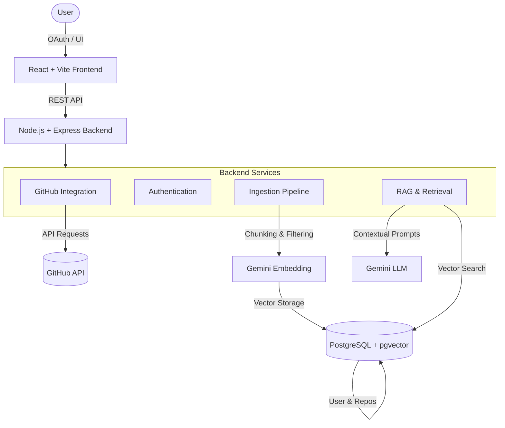

# System Architecture

RepoMind uses a modern, full-stack architecture separated into distinct layers.

## High-Level Component Diagram

## 1. Frontend Layer
* **Framework**: React 19 + Vite 8
* **Styling**: Tailwind CSS 4
* **State Management**: React Context (`AuthContext`, `RepositoryContext`)
* **Routing**: React Router DOM
* **Components**: Structured under `src/components`, separating UI logic from page layouts in `src/pages`.
* **API Communication**: Dedicated API utilities for backend communication.
* **Main Views**: Dashboard, Repository Code Explorer, Ask Repo, Onboarding, Architecture Visualization.

## 2. Backend Layer
* **Framework**: Express.js
* **Controllers**: Map HTTP requests to business logic (e.g., `ingestionController.js`, `askController.js`).
* **Services**: Core business logic modules (e.g., `repositoryIngestionService.js`, `ragService.js`, `startupRecoveryService.js`).
* **Authentication**: GitHub OAuth flow with stateless session tokens.
* **Rate Limiting & Security**: Handled via `helmet`, `cors`, and `express-rate-limit`.

## 3. Data & Storage Layer
* **Database**: PostgreSQL
* **ORM**: Prisma Client
* **Vector Search**: `pgvector` extension used for semantic similarity mapping.
* **Entities**: `User`, `Repository`, `RepositoryFile`, `FileChunk`, `ChunkEmbedding`, `Conversation`, `ConversationMessage`, `RepositoryArchitecture`, `RepositoryOnboarding`.

## 4. AI & RAG Layer
* **Model**: `@google/genai` library targeting `gemini-2.5-flash`.
* **Embedding Model**: Used to generate 768-dimensional vectors for code chunks.
* **Retrieval Mechanism**: Cosine similarity (`<=>`) against `pgvector` indexed embeddings.
* **Similarity Threshold**: `0.60` (configurable via `VECTOR_SIMILARITY_THRESHOLD`).

## 5. Core Workflows

### Repository Indexing Flow
1. **Trigger**: User requests ingestion for a connected repository.
2. **Fetch Tree**: Backend requests the repository tree via GitHub API.
3. **Filtering**: Non-text, binary, and large files are ignored based on extensions and byte scans.
4. **Incremental Check**: Current file SHAs are compared with stored SHAs. Unchanged files are skipped.
5. **Content Extraction**: New/modified file contents are downloaded.
6. **Chunking**: Code is split into semantic chunks based on line breaks and constraints.
7. **Embedding Generation**: Gemini creates vectors for each new chunk.
8. **Storage**: Vectors are saved via Prisma to PostgreSQL.
9. **Cleanup**: Deleted files and their chunks are removed from the database.

### Question Answering (RAG) Flow
1. **User Query**: User asks a question in the "Ask Repo" interface.
2. **Query Embedding**: The backend converts the question into a vector.
3. **Similarity Search**: `pgvector` searches the current repository's `ChunkEmbedding` table for the top relevant chunks.
4. **Context Construction**: The backend filters chunks below the `0.60` similarity threshold and formats them into a repository context block with file paths and line numbers.
5. **Generation**: The context, conversation history, and system instructions are sent to Gemini to generate the grounded answer.
6. **Citation Mapping**: The exact source chunks used are returned to the frontend alongside the answer.

### Crash Recovery Flow
1. **Trigger**: Backend server starts up (`startServer` in `server.js`).
2. **Detection**: `startupRecoveryService.js` scans for repositories in `INGESTING` or `EMBEDDING` states that haven't been updated within `INGESTION_STALE_TIMEOUT_MS` (default 30 minutes).
3. **Recovery**: These stale jobs are automatically marked as `FAILED` with an explanatory error message, preventing the UI from being permanently locked in a loading state.
