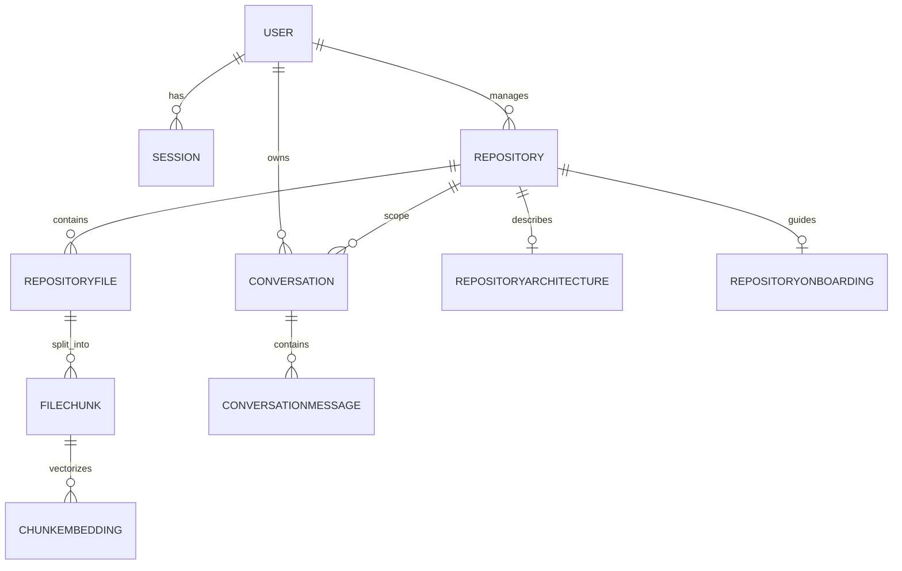

# Database Design

RepoMind uses PostgreSQL as its primary database, paired with the `pgvector` extension for storing and querying high-dimensional vectors. Prisma ORM is used for type-safe database interactions and migrations.

## Major Entities

* **User**: Stores authenticated user information (GitHub ID, username, email).
* **Session**: Stores active session tokens and expiration times for stateless authentication.
* **Repository**: Represents a GitHub repository connected to a user. Tracks ingestion status, file counts, and the latest indexed commit SHA.
* **RepositoryFile**: Represents a single file within an ingested repository. Stores the file path, extension, language, size, GitHub SHA (for incremental updates), and raw content.
* **FileChunk**: Represents a semantic segment of a `RepositoryFile`. Stores the chunk's content, start line, and end line.
* **ChunkEmbedding**: Stores the `pgvector` vector embedding for a `FileChunk`, along with the model used and dimension.
* **Conversation**: Represents a chat thread between a user and the AI regarding a specific repository.
* **ConversationMessage**: Represents individual messages (Role: User or Assistant) within a Conversation, including retrieved source citations.
* **RepositoryArchitecture**: Caches the generated high-level architecture summary for a repository.
* **RepositoryOnboarding**: Caches the generated developer onboarding guide for a repository.

## Entity-Relationship Diagram

## Vector Storage & Search
Embeddings are stored in the `ChunkEmbedding` table using the `Unsupported("vector(768)")` type in Prisma, mapped to the native `pgvector` extension in PostgreSQL.

During RAG retrieval, `retrievalService.js` executes raw SQL against the database using the `<=>` operator to calculate cosine distance between the user's query vector and the stored chunk vectors. The query explicitly joins `FileChunk` and `RepositoryFile` to enforce rigid repository isolation during vector search.
